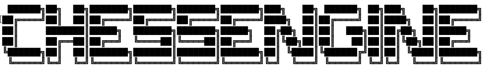

## A W.I.P cheat engine for Chess.com
*ChessEngine calculates and provides optimal moves by actively interpretting your Chess.com match in realtime.

# Status
* Session Info Extraction: Working
* Active Piece Identification: Working 
* Board Status Identification: Working
* Player Colour Identification: Working
* Player Turn Detection: Working
* Game End Detection: Working
* Extract Piece Coordinates: Working 
* Piece Coordinate Storage: Working 
* Piece Movement Differentiation: Work in-progress
